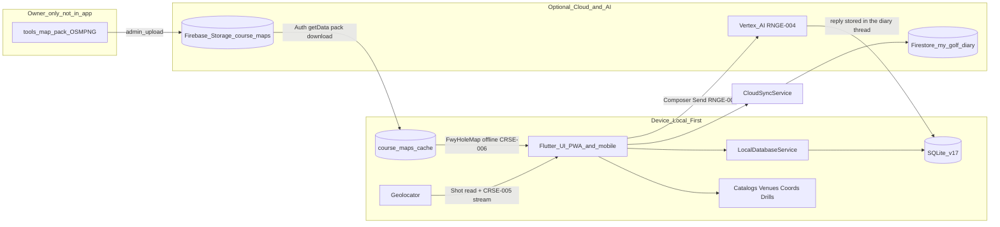
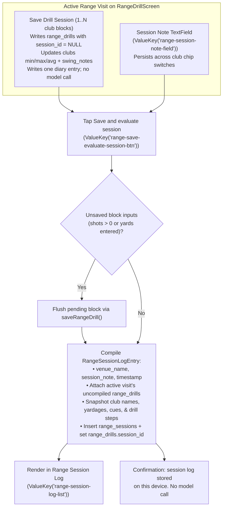
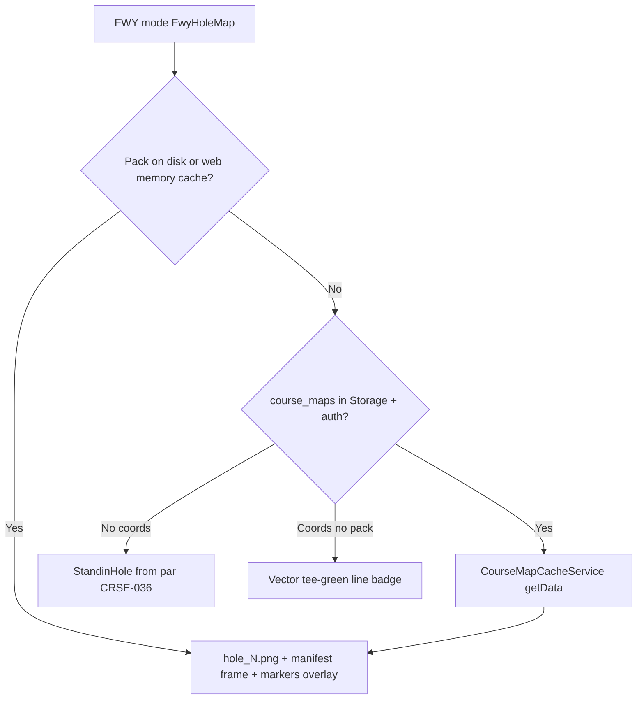
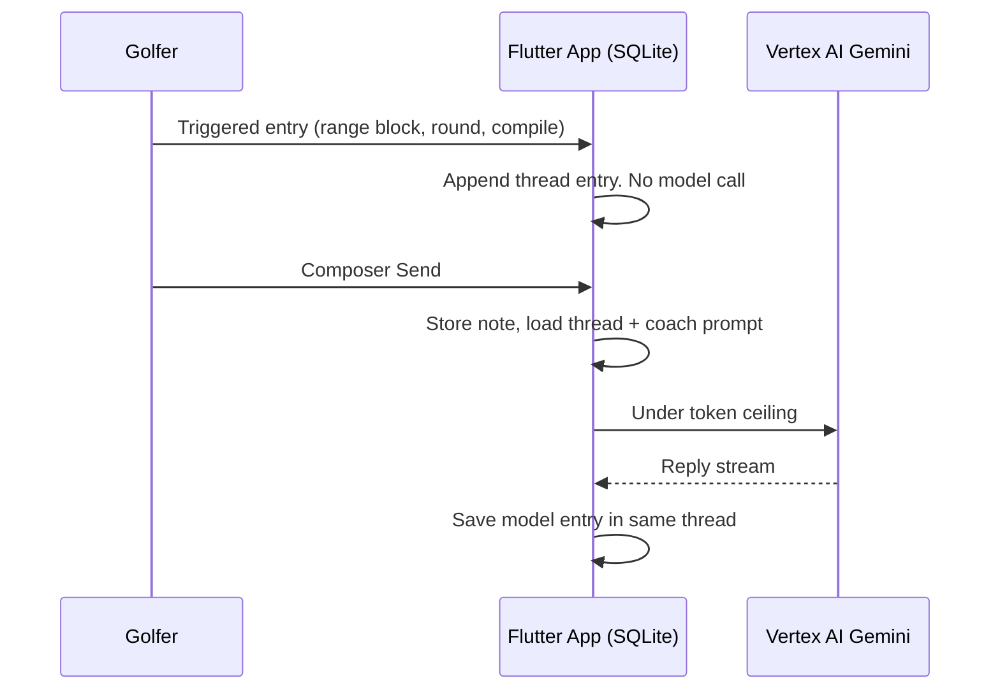

# Architecture — My Golf Diary

## Document Header

| Version | Status | Date | Owner |
| :--- | :--- | :--- | :--- |
| 1.22 | Active | 2026-11-24 | Athena |
| 1.21 | Superseded | 2026-11-23 | Watson |
| 1.20 | Superseded | 2026-11-23 | Watson |
| 1.19 | Active | 2026-11-23 | Athena |

**Inputs:** [`PRD.md`](./PRD.md) v1.13 · [`ProjectBrief.md`](./ProjectBrief.md) v1.0 · shards **MGDV-6-010…015** · [`PH_Golf_Venues.md`](./PH_Golf_Venues.md) · [`PH_Golf_Course_Hole_Coordinates.md`](./PH_Golf_Course_Hole_Coordinates.md) · [`Range_Drills.md`](./Range_Drills.md) · shards **`CRSE-035`–`036`**, **`CRSE-041`**.

---

## 1. System Overview

**My Golf Diary** is a **local-first** Flutter app (mobile + **PWA** on GitHub Pages) under [`golf_diary_app/`](../../golf_diary_app/). The **system of record** is **SQLite** (`sqflite`, **v17**). **On Course** splits **FWY** (fairway / outdoor) vs **SIM** (simulator): FWY uses a full-bleed **`FwyHoleMap`** shell (`CRSE-036`) with GPS shot capture, Live/Manual ball position, aim ring, and OSM stylized packs when cached (`CRSE-006` / `CRSE-041`); SIM keeps a compact scroll + bottom sheets (`CRSE-035`). Each **`ShotRecord`** stores ball position (or typed sim yards); segment distance is **Haversine** → yards. Live yards-to-green (`CRSE-005`) uses a filtered `geolocator` stream when surveyed coords exist and mode is FWY.

**Scoring** is **`round_scores`** per hole with **`finishHole`** holing-stroke rules (`CRSE-004`). **`MGDV-601`** adds derived **Gross / Molave / System 36** totals, optional rating/slope → unofficial handicap estimate, local **attestation** on `golf_rounds`, **flight** hole-gross publish (`flights/{flightId}`), and caddy **hole-score** rows for non-primary players. **Range** ships compiled **`range_sessions`** (`RNGE-005`) and tap-cycled shot totals (`range-shot-total` **10 → 3 → 5**). The **diary** (`RNGE-004`) is one ongoing thread: triggered writes stay local; **composer Send** (`diary-send-btn`) is the only UI model path. **My Bag** uses skill-tier **stat-tile** cards (`MGDV-203`). Optional **Firebase**: Firestore LWW sync for core and swing diary tables; **Firebase Storage** `course_maps/`; **`AccountAvatarAppBarMenu`** (`SYNC-006` partial). **PWA-002:** precached shell; `runApp` before optional Firebase init. Web: `sqflite_common_ffi_web` (IndexedDB).


```mermaid
flowchart LR
  subgraph device [Device_Local_First]
    UI[Flutter_UI_PWA_and_mobile]
    CAT["Catalogs Venues Coords Drills"]
    LDS[LocalDatabaseService]
    DB[(SQLite_v17)]
    PACK[(course_maps_cache)]
    GPS[Geolocator]
    UI --> CAT
    UI --> LDS
    LDS --> DB
    GPS -->|"Shot read + CRSE-005 stream"| UI
    PACK -->|"FwyHoleMap offline CRSE-006"| UI
  end
  subgraph build [Owner_only_not_in_app]
    MP[tools_map_pack_OSMPNG]
  end
  subgraph cloud [Optional_Cloud_and_AI]
    FS[(Firestore_my_golf_diary)]
    FST[(Firebase_Storage_course_maps)]
    GEMINI["Vertex_AI RNGE-004"]
  end
  MP -->|admin_upload| FST
  CS[CloudSyncService] --> FS
  UI --> CS
  FST -->|"Auth getData pack download"| PACK
  UI -->|"Composer Send RNGE-004"| GEMINI
  GEMINI -->|"reply stored in the diary thread"| DB
```

---

## 2. Technology Stack

| Tool / library | Version / note | Purpose |
| :--- | :--- | :--- |
| Flutter / Dart | SDK `>=3.0.0 <4.0.0` | UI & logic |
| sqflite / sqflite_common_ffi / sqflite_common_ffi_web | `^2.3.0` / `^2.3.3` / `^1.0.0` | Local SQLite on mobile, desktop tests, and web PWA (IndexedDB) |
| path | `^1.9.0` | DB & local cache paths |
| geolocator | `^14.1.2` | Single-shot GPS capture, live distance-to-hole stream (`CRSE-005`), & `distanceBetween` |
| firebase_core | `^5.1.0` | Optional Firebase initialization |
| firebase_auth | `^7.0.1` | Anonymous Auth + partial Google/email (`AccountAuthController`, `SYNC-006`) |
| firebase_storage | `^14.1.0` | Authenticated `getData` download of OSM hole packs (`course_maps/`) |
| cloud_firestore | `^7.1.0` | Optional pull/push LWW sync on named DB `my-golf-diary` |
| firebase_ai | `^5.1.0` | Vertex AI (`FirebaseAI.agentPlatform()`) swing diary — owner-billed, no player API keys |
| firebase_app_check | `^0.5.1` | Web reCAPTCHA Enterprise before diary calls |
| google_sign_in | `^6.2.2` | Google durable sign-in (`SYNC-006`) |
| path_provider | `^2.1.5` | Native `course_maps/{courseId}/` disk cache |
| provider | `^6.1.2` | State management where needed |
| google_fonts | `^9.0.0` | Playfair Display, Inter, Roboto Mono |
| wakelock_plus | `^1.3.2` | Optional cart scoring keep-awake (`MGDV-401`) |
| qr_flutter | `^4.1.0` | Caddy invite QR (`MGDV-5`) |
| http | `^1.1.0` | Abort in-flight Vertex streams |
| *Map packs (server)* | Python `tools/map_pack/` + Overpass | OSM → stylized PNG + `manifest.json`; owner uploads — **no Maps SDK in Flutter** |
| *PWA publish* | [`.github/workflows/publish-pwa.yml`](../../.github/workflows/publish-pwa.yml) | Push to `main` touching `golf_diary_app/**` builds web and force-pushes orphan `gh-pages` |
| *Agent tooling* | [`.cursor/rules/graphify.mdc`](../../.cursor/rules/graphify.mdc) | Mandatory `graphify query` before code exploration (`AGENTS.md` / `CLAUDE.md`) |

---

## 3. Repository & App Layout

```
My-Golf-Diary/
├── tools/map_pack/                   # CRSE-041 pipeline (Python, not Flutter)
├── storage.rules                     # course_maps/** read if auth; write deny clients
├── storage.cors.json                 # GET for PWA + localhost web origins
├── firebase.json                     # Storage rules target
├── .github/workflows/publish-pwa.yml
├── graphify-out/                     # Knowledge graph (graphify mandatory before code exploration)
└── golf_diary_app/lib/
    ├── main.dart                     # Firebase init, OnboardingGate, HomeShell (default tab On Course)
    ├── data/                         # ph_golf_catalog, ph_golf_hole_coords, practice_drill_seed
    ├── models/                       # golf_models, course_map_manifest, golfer_profile, range_session, caddy_session, …
    ├── on_course/                    # hole_projection, fwy_aim, on_course_shot_segment, hud gating
    ├── pwa/                          # build ID, update host, published-build probe
    ├── range/                        # club chip helpers
    ├── screens/                      # clubs, fairway_tracker (FWY/SIM), range, scorecard, home_shell, onboarding, account/caddy shells
    ├── services/                     # local_database_service (v17), flight_service, course_map_cache_service, account_auth_controller, swing_diary_*, …
    ├── ui/                           # header_action_policy, yardage_display_copy
    ├── widgets/                      # fwy_hole_map, fwy_overlays, shared_header_actions, account_avatar_app_bar_menu, …
    └── theme/app_theme.dart

golf_diary_app/android/app/src/main/AndroidManifest.xml
golf_diary_app/ios/Runner/Info.plist
```

### 3.1 App shell, headers & navigation

- **`HomeShell`:** four-tab `NavigationBar` — **My Bag**, **Range**, **On Course** (default index), **Scorecard** — `IndexedStack` preserves tab state (`SHELL-001`).
- **`OnboardingGate`:** starter wizard until `golfer_profile.onboarding_completed`; PWA deep links: `?mode=caddy` → `CaddyShell`; `?mode=flight&token=` → `FlightJoinScreen` then shell (join completes from Scorecard flight sheet).
- **Trailing header:** every tab uses **`SharedHeaderActions`** → **`AccountAvatarAppBarMenu`** (`account-avatar-button`: Login, Sync, Profile, Settings — `SYNC-005` shipped). Legacy `sync_cloud_button.dart` remains for tests/reference; production UI is the avatar menu.
- **Golfer avatar** (`golfer_avatar.dart`, `golfer_avatar_circle.dart`): bundled portraits in `assets/avatars/` (512px PNG, transparent corners). One **`GolferAvatarCircle`** renders the header button, Account profile, Settings, and the diary sheet's "You" rows. **Precedence:** a signed-in Google `photoUrl` wins, as `SYNC-005` already specified. Next comes the illustrated avatar: `golfer_profile.avatar_choice` when set, otherwise female/male × tier (`seasoned_pro` → *seasoned*). Then initials for a signed-in account with no avatar, then the generic icon. Non-binary and prefer-not-to-say golfers get no gendered default and can pick any portrait. The menu re-provides `GolferProfileScope` to the Profile and Settings routes it pushes, so edits refresh the header.
- **Leading header:** **Bag** — add-club; **Range** — drills icon; **On Course FWY** — `PlayHeaderOverflowButton` (⋯: diary, caddy invite, Concede/Finish, on-course settings); **On Course SIM** — same overflow pattern; **Scorecard** — tier-aware diary/caddy per `HeaderActionPolicy`.
- **Diary access (`MGDV-206`):** `SwingDiarySheet` via **`diary-entry-{bag,range,on-course,scorecard}`** book icon in `SharedHeaderActions`; beginner tier may use `shell-header-overflow-btn`. **No** On Course edge swipe (retired).
- **MGDV-203 Bag:** one stat-tile card per club (~136dp); **Details sheet retired**; session count chip → range log sheet.

---

## 4. Module Breakdown (PRD prefixes)

| Prefix | UI & Widgets | Data & Persistence |
| :--- | :--- | :--- |
| `BAG` | `clubs_screen.dart` stat-tile cards (`MGDV-203`) | `clubs`; reads `golfer_profile` for yardage labels |
| `CRSE` | `fairway_tracker_screen.dart`, `fwy_hole_map.dart`, `fwy_overlays.dart`, `venue_name_field.dart` | `shots` (+ `aim_direction`, sim optional cols v15), `round_scores`, `golf_rounds`; `CourseMapCacheService` + `course_map_manifest.dart`; coords catalog `CRSE-005`; FWY `CRSE-036` / SIM `CRSE-035` |
| `SCOR` | `scorecard_screen.dart`, `scorecard_cart_panel.dart`, `scorecard_hole_editor.dart`, `course_round_dialog.dart`, `flight_sheet.dart` | `round_scores` (+ `paid_mulligans` v17), `golf_rounds` (+ format, attestation, rating/slope v17); `scoring_format.dart` (derived totals); `golfer_profile` view prefs |
| `RNGE` | `range_drill_screen.dart` (`range-shot-total` cycle), `SwingDiarySheet` (bottom composer) | `range_drills`, `practice_drills`, `range_sessions`; diary tables (`swing_diary_messages`, `range_evaluations`, `diary_settings`) |
| `SYNC` | `account_avatar_app_bar_menu.dart`, `account_auth_controller.dart`, `diary_sync_runner.dart` | `CloudSyncService` → Firestore; `SyncIdentity`; Storage pack reads; `google_sign_in` |
| `PWA` | `pwa_service_worker.js`, `PwaUpdateHost`, `tool/build_web.sh` | Precache manifest; `main.dart` optional Firebase (`unawaited(_startOptionalCloud())`) |
| `MGDV` | onboarding, `header_action_policy.dart`, `shared_header_actions.dart`, caddy + flight screens | `golfer_profile`; caddy SQLite + Firestore channel; **`FlightService`** + `flights/{flightId}`; `caddy_flight_players`, `caddy_player_holes` (v17) |

---

## 5. Data Models & SQLite

**DB:** `golf_diary.db`, currently **version 17** (`LocalDatabaseService._initDB`). Migration chain through **v16** unchanged (see v1.17 history); **v17** adds `golf_rounds` scoring format + attestation + rating/slope columns, `round_scores.paid_mulligans`, and caddy flight tables `caddy_flight_players`, `caddy_player_holes`.

**Swing diary in `syncFull` (v1.22):** `range_sessions`, `diary_context_notes`, `swing_diary_messages`, `range_evaluations` (`kSwingDiarySyncTables`).

**Still outside `syncFull` today:** `practice_drills`, `golf_rounds`, `golfer_profile`, `diary_settings`, caddy queue — expand when the rest of `SYNC-007` lands (PRD).

### Tables (current)

- **`clubs`** — `id`, `name`, `category`, `brand`, `model`, `min_distance`, `max_distance`, `avg_distance` (yards), `swing_notes`, `is_synced`, `updated_at_ms`, `deleted`. Starter bag seeded on create.
- **`shots`** — above plus **`aim_direction`** (`left`/`center`/`right`, v15); optional **`sim_carry_yards`**, **`sim_distance_to_hole_yards`** (simulator, v15). **`isHoled`** is derived: `notes == 'Holed'` (`kHoledShotNote`). Holed strokes use putter + `lie_type` green (`finishHole` / `_recordHoledStroke`).
- **`round_scores`** — above plus **`paid_mulligans`** (v17, tournament mulligan; clamp one per nine; excluded from HIO/Molave rules). **`paid_mulligans`** is in the `round_scores` sync column list so LWW pull does not drop it. Practice **`mulligans`** unchanged.
- **`golf_rounds`** — `round_id`, `course_name`, timing fields, sync metadata, plus v17: **`scoring_format`** (`gross`|`molave`|`system36`), **`molave_double_eagle_pts`**, **`paid_mulligan_fee_php`**, **`course_rating`**, **`slope_rating`**, **`attested_at_ms`**, **`attested_by_name`**, **`attested_role`**, **`edited_after_attest_count`**. **`golf_rounds` stays out of `syncFull`** until `SYNC-007` / tournament enrollment (PRD MGDV-6-010).
- **`range_drills`** — same columns including nullable **`session_id`** → `range_sessions.id` (NULL = active visit block or legacy row).
- **`practice_drills` *(v5 — `RNGE-003`)*** — `id TEXT PRIMARY KEY`, `title TEXT NOT NULL`, `category TEXT NOT NULL`, `short_description TEXT NOT NULL`, `steps_json TEXT NOT NULL` (JSON array of step strings), `recommended_clubs TEXT`, `is_custom INTEGER NOT NULL DEFAULT 0`, `is_synced INTEGER NOT NULL DEFAULT 0`, `updated_at_ms INTEGER NOT NULL DEFAULT 0`, `deleted INTEGER NOT NULL DEFAULT 0`.
  - *Seed & Delete Mechanics:* On DB upgrade/create, `practice_drills` seeds the 12 reference drills from [`Range_Drills.md`](./Range_Drills.md) using their stable IDs (`rng-drl-*`) with `ConflictAlgorithm.ignore`. When a user deletes any drill (seeded or custom), `deleted = 1` and `updated_at_ms = _nowMs()` are set. Queries filter `WHERE deleted = 0`, ensuring deleted seeded drills stay hidden across restarts and sync.
- **`range_sessions` *(v6 — `RNGE-005` shipped)*** — `id TEXT PRIMARY KEY`, `venue_name TEXT NOT NULL DEFAULT ''`, `session_note TEXT NOT NULL DEFAULT ''`, `compiled_summary_json TEXT NOT NULL DEFAULT '[]'`, `timestamp INTEGER NOT NULL`, `is_synced INTEGER NOT NULL DEFAULT 0`, `updated_at_ms INTEGER NOT NULL DEFAULT 0`, `deleted INTEGER NOT NULL DEFAULT 0`.
  - `compiled_summary_json` snapshots the ordered list of club blocks at compile time (`clubId`, `clubName`, `shotCount`, `minYards`, `avgYards`, `maxYards`, `tempoNotes`, `drillId`, `drillTitle`, `drillSteps`) so the compiled session log remains self-contained for the Range session log even if a club or custom drill is later edited or deleted. Compiling this row does not call the model (`RNGE-004`, §5.7).

**Scoring helpers** (`golf_models.dart`): `computeFinalScore(strokes, penalties) = strokes + penalties` — practice **mulligans** stored but **not** in gross. **`scoring_format.dart`** derives Molave/System 36/net without rewriting `strokes`. Unofficial handicap uses WHS-style differential from entered rating/slope (not PH catalog).

#### 5.0.1 MGDV-601 formats, attestation & flight (shipped v17)

- **Local-first:** format switch on Scorecard recalculates UI totals only.
- **Attestation:** `attestRound` / `invalidateAttestation` on edit; caddy `attestPlayerCard` can attest primary card.
- **Flight:** `FlightService` + Firestore `flights/{flightId}` (or in-memory when Firebase absent). Publishes **hole gross arrays** only; keeps `attestedHoleGross` snapshot for mismatch audit. Max 4 players.
- **Caddy multi-player:** `setHoleScore` with `targetPlayerId` → `caddy_player_holes`; primary golfer strokes unchanged on other-player holes.
- **Planned (`MGDV-6-010+`):** see §5.0.2 — **documented, not implemented** (DB still v17).

#### 5.0.2 MGDV-6 pilot tournament (planned DB v18 + Firestore)

**Intent:** Club Intramuros pilot only. **Local-first:** enroll and play offline; publish standings when online. **Not** Gscore/back-office. Enrollment is the **SYNC-006 durability gate** (Google or email account — anonymous users see sign-in, not a hard app lock).

**Planned SQLite (migration v18)** — implement in shard order **MGDV-6-010** first:

| Table | Purpose |
| :--- | :--- |
| **`tournament_events_cache`** | `event_id TEXT PK`, `title`, `course_venue_id`, `starts_at_ms`, `closes_at_ms`, `scoring_format`, `molave_double_eagle_pts`, `paid_mulligan_policy`, `fee_copy`, `diary_silence`, `marker_required`, `committee_locked`, `source_json`, `updated_at_ms` — mirror of Firestore event doc for offline list/detail. |
| **`tournament_enrollments`** | `event_id`, `user_id` (Firebase uid), `status` (`enrolled` \| `withdrawn`), `flight_id` nullable, `enrolled_at_ms`, `withdrawn_at_ms`, `is_synced`, `updated_at_ms`. Unique (`event_id`, `user_id`). |
| **`golf_rounds`** *(alter)* | nullable **`event_id`** FK → active enrollment; **`event_round_status`** (`in_progress` \| `submitted` \| `late_correction`). Format columns from v17 stay authoritative for totals. |
| **`tournament_standing_cache`** | `event_id`, `user_id`, `format_total`, `audit_flags_json`, `rank`, `updated_at_ms` — last pulled leaderboard snapshot for offline read (`tournament-leaderboard-stale` when stale). |

**Services (planned):** `TournamentEventRepository` (pull seed + Firestore), `TournamentEnrollmentService`, `TournamentLeaderboardService` (sort via existing `scoring_format.dart` helpers), `TournamentSubmitService` (attestation policy from event row).

**Firestore** (database `my-golf-diary`, top-level — **not** under `users/{uid}`):

```
tournament_events/{eventId}           // catalog doc (committee/seed writes out-of-band)
tournament_events/{eventId}/enrollments/{uid}
tournament_events/{eventId}/standings/{uid}   // published format total + audit flags
tournament_events/{eventId}/submissions/{uid} // optional attested card payload refs
```

**Pilot security rules (target for MGDV-6-010 deploy):**

- **`tournament_events/{eventId}`** — `read` if `request.auth != null`; `write` if false (admin seed / Cloud Function only).
- **`enrollments/{uid}`** — `read` if authenticated; `create/update` if `request.auth.uid == uid` and event not `committee_locked`.
- **`standings/{uid}`** — `read` if authenticated and caller has enrollment doc for same `eventId`; `write` if `request.auth.uid == uid` (self publish) OR marker uid in `event.marker_uids` (MGDV-6-013).
- Reuse **flight** publish for hole gross arrays; standings row is derived summary, not live shot feed.

**Sync interaction:** `tournament_enrollments` may sync under `users/{uid}/tournament_enrollments/{eventId}` **or** rely on pull of top-level enrollments — pick one in **MGDV-6-010** implementation; document in shard when coded. **`golf_rounds` + format/attestation** enter `kSyncTables` together with **SYNC-007** or a narrower **MGDV-6-010** exception for enrolled rounds only (product decision: prefer SYNC-007 first, then event publish uses standing cache).

**MGDV-6-015 (caddy hardening):** upgrade `caddy_round_channels` rules so `events` writes require `request.auth.uid` in channel `principal_uids[]`; add `caddy_hole_disputes` local audit rows keyed by `round_id` + `hole_number` (no stroke overwrite on dispute flag until golfer accepts).

### 5.1 Yards vs meters

- **Storage:** all distance columns are **yards**.
- **GPS math:** `distanceBetween` → meters → **`meters * 1.09361`** in `recordFairwayHit` and in `CRSE-005` live distance-to-hole.
- **v1:** no user-facing meters preference; adding one needs PRD + conversion layer.

### 5.2 Strokes vs shots (source of truth)

| Concept | Where | Meaning |
| :--- | :--- | :--- |
| **Shot** | `shots` | GPS-logged stroke on a hole (club, lie, positions). |
| **Strokes (scoring)** | `round_scores.strokes` | Used for **gross** with penalties. |

**Fairway path:** `recordFairwayHit` inserts a shot, then **`syncStrokeCountFromShots`** sets **`strokes = shots.length`** for that hole. So **recording a GPS shot overwrites** the hole’s stroke count with **shot count** (manual scorecard strokes can be replaced).

**Manual path:** `saveManualHoleScore` writes `strokes` directly; no auto-reconcile until another `syncStrokeCountFromShots` runs.

**HUD:** `strokes = holeScore?.strokes ?? shots.length`.

**Architectural stance:** `round_scores` is the **scorecard row**; `shots` is the **GPS audit**. Precedence for `strokes` after fairway capture is **syncStrokeCountFromShots** until product adds “manual lock” or merge rules.

#### 5.2.1 Finish hole & holing stroke (`CRSE-004` — shipped)

`LocalDatabaseService.finishHole`:

1. **`syncStrokeCountFromShots`** on the active hole.
2. **`_recordHoledStroke`** unless: hole **conceded**; **pickup at double par** (`strokes + penalties ≥ 2 × par`); or the last shot is already **`isHoled`**. Otherwise appends one **putter / green** shot with note **`Holed`**, then syncs strokes again.
3. Recomputes **`final_score`** for non-conceded holes; advances hole or **`completeRound`** on last hole.

**Concede:** `concedeHole` sets `conceded = 1`, `strokes = par × 2`, updates `final_score` — **no** holing stroke on subsequent `finishHole` (see `finish_hole_holing_stroke_test.dart`). **Known gap:** concede then manual scorecard edit vs shot-sync precedence — same class of conflict as §5.2 / caddy merge (PRD §7).

### 5.3 RNGE → club (`saveRangeDrill`)

After inserting **`range_drills`**, updates **`clubs`** for `log.clubId`:

- **min:** if club min was 0 → use `log.minYards`; else `min(club.min, log.minYards)`
- **max:** `max(club.max, log.maxYards)`
- **avg:** if club avg was 0 → `log.avgYards`; else `(club.avg + log.avgYards) / 2` (pairwise blend—not a true running mean over all shots)
- **swing_notes:** replace with `log.tempoNotes` if non-empty
- mark `is_synced = 0`

**Diary entry (`RNGE-004`):** the same save appends one thread entry and does not call Vertex. The entry holds the club, the drill when one is linked, the result (shot count and min/avg/max yards), and the per-club note when the golfer wrote one. A block with no note still writes the entry. Storage is §5.7.

Changing this math requires **Version History** + migration if schema changes.

### 5.3.1 Session Note & Compiled Range Session Log (`RNGE-005` — shipped v6)

A range visit often spans several clubs and drills before the golfer wraps up with personal takeaways. `RNGE-005` separates **per-club block capture** from **visit-level session compilation**:


```mermaid
flowchart TD
  subgraph Active_Range_Visit [Active Range Visit on RangeDrillScreen]
    ClubBlocks["Save Drill Session (1..N club blocks)\nWrites range_drills with session_id = NULL\nUpdates clubs min/max/avg + swing_notes\nWrites one diary entry; no model call"]
    SessionNote["Session Note TextField\n(ValueKey('range-session-note-field'))\nPersists across club chip switches"]
  end
  Trigger["Tap Save and evaluate session\n(ValueKey('range-save-evaluate-session-btn'))"]
  Flush{"Unsaved block inputs\n(shots > 0 or yards entered)?"}
  SavePending["Flush pending block via saveRangeDrill()"]
  Compile["Compile RangeSessionLogEntry:\n• venue_name, session_note, timestamp\n• Attach active visit's uncompiled range_drills\n• Snapshot club names, yardages, cues, & drill steps\n• Insert range_sessions + set range_drills.session_id"]
  UIList["Render in Range Session Log\n(ValueKey('range-session-log-list'))"]
  Saved["Confirmation: session log stored\non this device. No model call"]

  ClubBlocks --> Trigger
  SessionNote --> Trigger
  Trigger --> Flush
  Flush -->|Yes| SavePending --> Compile
  Flush -->|No| Compile
  Compile --> UIList
  Compile --> Saved
```

- **Two Distinct Note Scopes on `RangeDrillScreen`:**
  1. **Per-club Swing Cue & Mechanics Note (`_notesController`):** Reloads from `club.swingNotes` when switching club chips (or when tapping a practice drill title in `PracticeDrillSheet`) and saves onto each `RangeDrillLog` row and `clubs.swing_notes`.
  2. **Session Note (`_sessionNoteController`, `ValueKey('range-session-note-field')`):** Holds the golfer's overall thoughts and personal review of the range visit. Owned by `RangeDrillScreenState` (and preserved across tab switches by `HomeShell`'s `IndexedStack`), it is **never** overwritten when the golfer switches club chips or saves an individual club block.
- **Tracking Active Visit Blocks:**
  - As the golfer records clubs during a visit, `RangeDrillScreenState` tracks the IDs of `RangeDrillLog` rows saved during the current visit (or queries `range_drills` from today where `session_id IS NULL` and `deleted = 0`).
- **`compileAndSaveRangeSession` Transaction (`LocalDatabaseService`):**
  1. **Pending Block Flush:** When the golfer taps **Save and evaluate session** (`ValueKey('range-save-evaluate-session-btn')`), if the current club form has unsaved shot/yardage input (`_shotCounter > 0` or any of min/avg/max is non-empty), `RangeDrillScreen` first flushes that block via `saveRangeDrill` so no work is lost. If neither any club block in the visit nor a non-empty `session_note` exists, the button prompts the golfer to log a club block or write a session note first.
  2. **Compilation:** Joins the visit's `RangeDrillLog` rows with `clubs` (for `clubName`) and `practice_drills` (for `drill.title` and `drill.steps`), serializes the structured block list into `compiled_summary_json`, inserts a new `range_sessions` row (`id: 'rsess_${nowMs}'`), and sets `session_id = id` on the member `range_drills` rows inside a single SQLite transaction.
  3. **Post-Compile Reset:** Clears `_sessionNoteController`, resets the active visit's pending block list, and reloads the screen.
- **Session Log Rendering (`ValueKey('range-session-log-list')`):**
  - `RangeSessionLog` displays compiled `range_sessions` entries (showing date/time, venue, the overall `session_note`, and a compact breakdown of each club/drill block in the session) alongside any standalone/legacy `range_drills` rows, while preserving the existing `This club` / `All clubs` filter (filtering compiled sessions that include the selected club).
- **Handoff to `RNGE-004`:**
  - Each `saveRangeDrill` already wrote one diary entry (§5.3, §5.7). `compileAndSaveRangeSession` returns the persisted `RangeSessionLogEntry` and stops. Online or offline, the screen confirms the session log is stored on this device. It does not open an evaluation and does not call Vertex.

### 5.4 Live GPS Distance to Hole (`CRSE-005`)

- **Coordinate Lookup (`ph_golf_hole_coords.dart`):** Encodes verified WGS84 6-decimal Tee and Green/Pin coordinates from [`PH_Golf_Course_Hole_Coordinates.md`](./PH_Golf_Course_Hole_Coordinates.md) keyed by canonical course name and `holeNumber` (1–18).
- **Gating Rule:** `hasHoleCoordinates(courseName, holeNumber)` is true **only** when On Course is in `Course` mode (`!_simulator`) and a verified `HoleCoordinates(teeLat, teeLon, greenLat, greenLon)` entry exists for that exact course and hole.
  - Full 18-hole mapped courses (16 layouts) enable the metric on holes 1–18.
  - Partial courses (e.g., Hallow Ridge H1–H4, H6–H9; Sherwood Hills mapped holes) enable the metric **only** on mapped holes and turn it off on unmapped holes.
  - Unmapped courses (centroid-only or custom names) keep the metric and stream completely off.
- **Stream Lifecycle & Battery:**
  - When gated **on**, `FairwayTrackerScreenState` subscribes to `Geolocator.getPositionStream(locationSettings: const LocationSettings(accuracy: LocationAccuracy.high, distanceFilter: 3))` (3-meter movement threshold) and performs an initial `getCurrentPosition` read so yardage appears immediately.
  - Remaining yardage is `((Geolocator.distanceBetween(pos.latitude, pos.longitude, greenLat, greenLon)) * 1.09361).round()`, rendered in `ValueKey('on-course-distance-to-hole')`.
  - The stream subscription is **cancelled immediately** on `dispose()`, when switching to `Simulator` mode, when changing to an unmapped course/hole, or when app lifecycle pauses.

### 5.5 OSM hole map packs & offline cache (`CRSE-006` / `CRSE-041` — shipped client; packs in progress)

**Decision (supersedes Architecture 1.15 Google Static path):** Hole imagery is **stylized OpenStreetMap** golf features rendered offline — **not** Google Maps satellite tiles. Google Maps Static/Tile APIs are **out of scope** for v1 (licensing forbids redistributing cached satellite; see shard [`CRSE-041`](../../docs/shards/CRSE/CRSE-041-map-pack-pipeline.md)). Architecture **1.15** remains in Version History for audit only.


```mermaid
flowchart TD
  FWY["FWY mode FwyHoleMap"] --> Local{"Pack on disk or web memory cache?"}
  Local -->|Yes| RenderPNG["hole_N.png + manifest frame + markers overlay"]
  Local -->|No| Remote{"course_maps in Storage + auth?"}
  Remote -->|Yes| DL["CourseMapCacheService getData"] --> RenderPNG
  Remote -->|No coords| Standin["StandinHole from par CRSE-036"]
  Remote -->|Coords no pack| Vector["Vector tee-green line badge"]
```

**Build pipeline (owner, not Flutter):** [`tools/map_pack/`](../../tools/map_pack/) — Overpass → normalize to surveyed tee/green → flat-colour PNG (720×1280, tee at bottom) + per-hole **`markers[]`** (target/layup) in `manifest.json`. Upload via `upload_packs.py` to **`course_maps/{courseId}/`** and merge **`course_maps/index.json`** versions. Contract: shard CRSE-041 + `tools/map_pack/README.md`.

**Client (`CourseMapCacheService`):**

- **`courseId`:** `ph-crse-*` map in `kCourseMapPackIds` (must match `courses.py`).
- **Fetch:** `SyncIdentity.ensureSignedIn()` then, on native, `FirebaseStorage.instance.ref(path).getData()` (10 MB cap); on web, a per-session cached `getDownloadURL()` plus one HTTP GET (web `getData` would add `getMetadata` + `getDownloadURL` round trips per object). Remote packs live at `course_maps/{courseId}/v{version}/` (immutable), with the unversioned layout as fallback.
- **Versions:** the newest **stored** version opens at once (offline too); `index.json` is read once per session in the background, and a changed version is downloaded in full, switched to, and the old one pruned. The new manifest is stored last so a partial download never hides a complete pack.
- **Order:** the requested hole is fetched first and rendered; the rest of the pack follows in the background (4 parallel reads).
- **Native cache:** `<appDocDir>/course_maps/{courseId}/v{version}/` (`DiskCourseMapPackStore`); pre-versioning packs in `course_maps/{courseId}/` are read as their manifest version until replaced.
- **Web PWA:** browser **Cache API** cache `golf-diary-course-maps-v1` (`CacheApiCourseMapPackStore`), keyed by course + version + file; `pwa_service_worker.js` keeps it across shell updates. **No** SQLite `course_map_cache` table.
- **Decode:** one `Uint8List` per image for stable `MemoryImage` keys; `ResizeImage` to display width when smaller than the source; FWY precaches the next hole.
- **Manifest:** `CourseMapManifest` / `HoleMapFrame` with `frame.centerLat/Lon`, `bearingDeg`, `metersPerPixel`, `holes[].markers[]` for aim snap (`CRSE-039`).
- **Attribution:** `oncourse-map-attribution` — **© OpenStreetMap contributors (ODbL)** when pack image visible.

**Caching tiers**

| Tier | Location | Writer | Reader |
| :--- | :--- | :--- | :--- |
| 1 | OSM Overpass + `build_pack.py` | Owner laptop/CI | — |
| 2 | `gs://…/course_maps/{courseId}/v{version}/manifest.json`, `hole_{n}.png` (immutable; `index.json` no-cache) | `upload_packs.py` (service account) | Authenticated app read |
| 3 | App doc dir (native) or Cache API (web), per version | App after download | `FwyHoleMap` / `fwy_hole_map.dart` |

**Coverage gap:** Pipeline exists; not every catalog course has a published pack yet — FWY falls back to vector or stand-in without error (PRD `CRSE-011`).

### 5.6 FWY map-background shell & SIM compact layout (`CRSE-036` / `CRSE-035` — shipped)

| Mode | UI shell | Map |
| :--- | :--- | :--- |
| **FWY** (`!_simulator`) | Full-bleed **`FwyHoleMap`**; top scrim overlay (`oncourse-top-overlay`); side **rail** (club / lie / aim / pen / mul); shots peek sheet; **Record shot at ball** only in dock | Pack PNG, vector line, or **stand-in** (`StandinHole.forPar`) |
| **SIM** (`_simulator`) | Single-scroll compact stack + bottom sheets (`CRSE-035`); Record / Concede / Finish dock | **No** map pane |

**FWY specifics (see shard CRSE-036):**

- **Live vs Manual GPS** (`oncourse-gps-badge`, `OnCourseSettings`): Manual pin with stale-fix gate.
- **Aim ring** (`fwy_aim.dart`, `on_course_aim.dart`): snap to ring or manifest markers; persists **`shots.aim_direction`** L/C/R (v15); full bearing columns deferred.
- **Double par:** banner `oncourse-double-par-banner` — never auto-finishes; pairs with §5.2.1 holing-stroke skip.
- **Header:** leading overflow (diary, caddy, settings entries); trailing account avatar — legacy **`on-course-map-toggle`** / tabular FWY card **removed**.
- **Diary (`RNGE-004`):** finishing the round, or leaving it, in **FWY** or **SIM** writes one thread entry (course, mode, score, short shot summary) and does not call the model. See §5.7.

### 5.7 One diary thread (`RNGE-004` — PRD 1.13)

**Save and evaluate session** compiles `range_sessions` (§5.3.1) and does not call the model. The diary is **one ongoing thread** opened from **`diary-entry-*`** header icons (`MGDV-206`). **`SwingDiarySheet`** pins a multiline **composer** at the bottom (`diary-composer-field`, `minLines` 1 / `maxLines` 6); **Send** shows **`diary-send-busy`** while streaming. There is no **`diary-feedback-btn`**, **Save note on this device**, or **Summarize today** in the main sheet (evaluation history remains via **`diary-evaluation-log-btn`**).

**When the model is not called:**

1. **Range block** (`saveRangeDrill` → `SwingDiaryService.appendContextNote`).
2. **FWY/SIM** finish or leave; **Scorecard** finish with format summary (`fairway_tracker_screen`, `scorecard_screen`).
3. **`compileAndSaveRangeSession`** (`RNGE-005`).

**When the model is called:** **Composer Send** only — store golfer text, then `VertexDiaryModel` with coach prompt + thread context (opt-in, online, App Check). Offline: text may persist; no call until Vertex is available.


```mermaid
sequenceDiagram
  participant User as Golfer
  participant App as Flutter App (SQLite)
  participant AI as Vertex AI Gemini

  User->>App: Triggered entry (range block, round, compile)
  App->>App: Append thread entry. No model call
  User->>App: Composer Send
  App->>App: Store note, load thread + coach prompt
  App->>AI: Under token ceiling
  AI-->>App: Reply stream
  App->>App: Save model entry in same thread
```

**Who pays.** Unchanged. `FirebaseAI.agentPlatform()` (the `firebase_ai` 5.1 rename of `vertexAI()`) with App Check when the Firebase app is already configured, and the existing anonymous user. The model is `gemini-3.8-flash`. `gemini-2.5-flash` was shut down on Agent Platform on 2026-10-20. No `google_generative_ai` client and no API key in the binary. The project owner pays Vertex AI on `novusinc-8df79` while the diary stays under about **1,000 people**. At about 1,000 people, stop and plan again. Players do not paste their own Gemini keys. Vertex is billed only for tokens sent. The 250,000 figure is a ceiling, not the size of a new player's prompt. Opt-in is a local `diary_settings` row and is not part of `syncFull`; pulling a live `swing_diary_messages` row sets it, because the golfer opted in where that thread was written. There is no second persona.

**What each call contains**, in order. The existing coach prompt stays. Diary entries are its context. A compiled `range_sessions` row is not attached and does not start the call.

1. **Coaching `systemInstruction`** (`Content.system` in `VertexDiaryModel`): a universal biomechanics / physio / caddie method, then this golfer's `golfer_profile` baseline, current bag, and frequent venues. Empty pillars add one optional Caddie Check-In. The method does not hard-code one person's clubs or injuries. Yardages stay grounded in the logged SQLite numbers.
2. **Current bag (`clubs` from SQLite)** — club names, categories, brand/model specs, recorded `min / avg / max yd`, and per-club `swing_notes`.
3. **Progress brief** — present only after a periodic summary exists. It states clubs and drills they returned to, cues they wrote, and how min / avg / max moved.
4. **Per-club tally** from SQLite, not from the model: session count, average this period versus the previous period, and the drill titles used most. Numbers stay exact after older notes are shortened.
5. **Diary thread entries, still raw**, while under the ceiling: range-block entries, round entries, typed notes, and earlier model replies.
6. **This ask, in full** — the thread including the note just typed.

**250,000-token ceiling.** Count the prompt before the call. While it fits, send the raw thread so the reply can see focus and progress directly. When the next call would pass about 250,000 tokens, compact the oldest material:

- Write a **periodic summary** row (the new progress brief) from the thread plus the previous brief. Keep the comparison facts above.
- Leave a recent raw window (about a month of entries, or the last several dozen) verbatim.
- Leave the entries this call is about in full.
- Later calls send the brief, the tally, the recent window, and those entries. Cost per message stays flat after the ceiling. It does not grow because the account is older.

**What is stored.** One visible thread, in `swing_diary_messages`, ordered by `timestamp`. Roles stay `user` and `model`. The sheet renders this list. No new table.

| Write | `swing_diary_messages` | Also stored | Model |
| :--- | :--- | :--- | :--- |
| Range block | `role = user`. Content is club, drill when linked, shot count, min/avg/max yards, and the note when present | `diary_context_notes` (`source = range`) with the same content | No |
| FWY/SIM finish or leave | `role = user`. Content is course, mode, score, and a short shot summary | `diary_context_notes` (`source = on_course`, `round_id` set) | No |
| Typed note | `role = user`. Content is the text, saved before any call | `diary_context_notes` (`source = diary`) | Then yes, if opted in and online |
| Composer reply | `role = model`. Content is the reply | `range_evaluations` with `kind = evaluation` (same text) | This row **is** the call's result |
| Periodic summary | Shown in the thread, marked as a compaction note | `range_evaluations` with `kind = periodic_summary` | Written locally when the next prompt would pass the ceiling. Not a golfer-facing ask |

`diary_context_notes` (shipped): `id`, `source`, `content`, `context_date`, `round_id`, `timestamp`, plus the usual `is_synced` / `updated_at_ms` / `deleted`. A range block with no prose note still inserts a row; the result fields are the content. An empty string is not a valid entry.

`range_evaluations` (shipped, v7). `session_id` does not start a call. Composer replies may leave it null. A periodic summary leaves it null.

| Column | Purpose |
| :--- | :--- |
| `id` | Primary key |
| `kind` | `evaluation` (a thread reply) or `periodic_summary` (the progress brief) |
| `session_id` | Nullable. Not the trigger |
| `session_date` | `YYYY-MM-DD` the note is about |
| `content` | The text the player can read. For `evaluation`, the same text as the `model` message |
| `prompt_tokens` | Size of the prompt that produced it, when known |
| `covered_through_ms` | For a periodic summary, the newest thread timestamp folded into the brief |
| `referenced_drill_ids_json` | Drills cited |
| `referenced_club_ids_json` | Clubs cited |
| `timestamp` | When the row was written |
| `is_synced`, `updated_at_ms`, `deleted` | Same sync shape as other diary tables. Sync can wait |

An `evaluation` row is the durable copy of a model entry in the thread. A `periodic_summary` row is the progress brief used in later prompts and shown in the same thread, marked so a reader can tell a compaction note from an analysis. Both are enough to re-read offline without calling Vertex again.

Do not add an embedding index in this phase. A question about a specific older day loads that day's thread entries by date and adds only those rows. When a number the entry does not carry is needed, load that day's `range_drills` or `range_sessions` by date and club as well. The compiled session log is not the prompt.

---

## 6. Sync & External Services

- **Init:** Optional cloud in `_startOptionalCloud()` after first frame (not blocking `runApp`). Uses [`firebase_options.dart`](../../golf_diary_app/lib/firebase_options.dart). Failure is soft; the app stays local-only.
- **Database:** named Firestore database `my-golf-diary` via `FirebaseFirestore.instanceFor(databaseId: ...)`. Do not write the `(default)` database.
- **Identity:** Firebase **Anonymous Auth** by default; **`AccountAuthController`** adds Google / email-password (`SYNC-006` partial). `SyncIdentity.ensureSignedIn()` and map-pack reads require **some** Firebase Auth session (anonymous OK). Enable Anonymous (+ Google/Email when testing durable accounts) in console.
- **Map packs:** Storage paths under `course_maps/`; same anonymous gate as sync. Deploy [`storage.rules`](../../storage.rules): read if `request.auth != null`; **write: false** for clients. CORS: [`storage.cors.json`](../../storage.cors.json) for PWA + `localhost` (GET only).
- **PWA:** [`.github/workflows/publish-pwa.yml`](../../.github/workflows/publish-pwa.yml) on `main` → `flutter build web` with `APP_BUILD_ID` = git SHA → orphan **`gh-pages`**. **`PWA-002`:** `golf-diary-shell-v2` service worker precaches shell + local CanvasKit; `main.dart` calls `runApp` before `unawaited(_startOptionalCloud())` with startup timeout (`kOptionalFirebaseStartupLimit`). Contract: `pwa_offline_shell_test.dart`. `PwaUpdateHost` prompts when published build is newer.
- **Client config:** `firebase_options.dart` holds the public web client config (API key is not a server secret). Re-run `flutterfire configure` when Android or iOS apps are registered.

**CloudSyncService.syncFull**

1. **Pull** every doc in `users/{uid}/{table}` for each table in `kSyncTables`: `clubs`, `shots`, `round_scores`, `range_drills`, plus the swing diary tables `range_sessions`, `diary_context_notes`, `swing_diary_messages` (the chat thread), and `range_evaluations`. `golf_rounds` and `practice_drills` are not synced yet.
2. **Last-write-wins:** remote `updatedAtMs` newer than local `updated_at_ms` replaces the row (`is_synced = 1`). A remote `deleted: true` tombstone removes the local row (or marks seeded `practice_drills` hidden with `deleted = 1`). An equal or older remote leaves the local row.
3. **Push** rows with `is_synced = 0`. A failed write stays dirty. A pushed tombstone is then removed locally (except seeded `practice_drills` rows, which retain `deleted = 1` locally so the seed is not re-inserted on next launch); the cloud doc stays so other devices can see the delete.

Club delete is a tombstone (`deleted = 1`), not an immediate local `DELETE`, so the next sync can tell other devices.

**Empty or unreadable account (`downloadAndSync`, `uploadLocalThenDownload`):** push first, then pull with tombstones ignored, so a new account cannot delete local rows (swing diary included). `replaceLocalWithRemote` deletes local rows missing from the account only when it has live rows. Diary rows count toward `RemoteDiaryState.hasEntries`.

### MGDV-5 — Caddy round channel (v1)

Pairing uses a top-level Firestore collection **`caddy_round_channels/{channelId}`** where `channelId` is the opaque single-use token in the PWA QR (`?mode=caddy&request=`). Golfer mints while an active round exists; caddy redeems once (transaction → `status: active`). Stroke/score actions append to **`events`**; the golfer app **`CaddyGolferMergeHost`** listens and applies via **`recordCaddyStroke`** → **`syncStrokeCountFromShots`**. Caddy offline writes queue in SQLite **`caddy_pending_events`** and flush on reconnect.

**v1 limits:** Event writes are authenticated but not yet bound to session principal in rules (see `firestore.rules` comment). **Manual golfer scorecard edits** on the same hole can be overwritten when the next caddy stroke syncs (same precedence as GPS shot sync in §5.2). **Player picker** + **`setHoleScore`** / **`attestPlayerCard`** for additional flight players ship in **`MGDV-601`** (local `caddy_player_holes`). Production token hardening and accept/dispute remain deferred (PRD **MGDV-6-015**).

**PWA entry:** `OnboardingGate` bypasses golfer onboarding when `mode=caddy` is present and loads **`CaddyShell`** (On Course + Scorecard tabs only).

### MGDV-601 — Flight channel (v1)

- Firestore **`flights/{flightId}`** (database `my-golf-diary`): embedded `players[]` with hole gross arrays and attestation snapshots. Rules: authenticated read/create/update (pilot — same looseness as caddy v1).
- **Memory fallback** when `Firebase.apps.isEmpty` (tests / offline).
- QR: `?mode=flight&token=` (`flight_launch_config.dart`).

### MGDV-6 — Club tournament pilot (planned)

- Entry UI: Scorecard overflow **Tournaments** → `TournamentListScreen` (wireframe [`Wireframe_Tournament.md`](./designs/Wireframe_Tournament.md)).
- **Committee lock** at `closes_at_ms` blocks enrollment writes and freezes standing rank mutations except `late_correction` audit (MGDV-6-013).
- **Post-close diary** inserts system thread row (`diary-tournament-wrap`); no Vertex unless composer Send (MGDV-6-014, §5.7).
- Pilot seed: single event id `ph-mgdv6-intramuros-pilot` in [`PH_Golf_Venues.md`](./PH_Golf_Venues.md) venue scope.

### Firestore security rules

Rules live in [`firestore.rules`](../../firestore.rules) and [`firebase.json`](../../firebase.json) targets database `my-golf-diary`. Deploy them on that database, not `(default)`:

```bash
firebase deploy --only firestore:my-golf-diary
```

```
rules_version = '2';
service cloud.firestore {
  match /databases/{database}/documents {
    match /users/{userId}/{subcollection}/{docId} {
      allow read, write: if request.auth != null && request.auth.uid == userId;
    }
  }
}
```

**Do not** ship `allow read, write: if true` on user paths. Rows previously stored under `users/local_user` are not migrated.

---

## 7. Security & Privacy

- SQLite at rest = OS defaults; no app-level encryption in v1.
- `firebase_options.dart` is public client config. Do not commit **service account keys**, **Maps API keys**, or **Gemini API keys** in repository source. Map-pack upload uses owner credentials outside the app (`GOOGLE_APPLICATION_CREDENTIALS` / `FIREBASE_SERVICE_ACCOUNT_JSON` in `tools/map_pack/` only).
- Sync exposes data to cloud—deploy the named-database rules and turn on Anonymous Auth before production use.
- **Firebase Storage (`CRSE-041`):** `course_maps/**` — authenticated read only; all writes via admin upload scripts (`allow write: if false` in [`storage.rules`](../../storage.rules)).
- **Vertex AI (`RNGE-004`):** `FirebaseAI.agentPlatform()`. Calls run only for **composer Send** (§5.7). Players do not supply Gemini keys. No model debug line in the diary UI.

---

## 8. Performance, Platform & Testing

- **GPS:**
  - **Shot capture (`CRSE-002`):** single `getCurrentPosition` per “Record Shot”.
  - **Live distance to hole (`CRSE-005`):** distance-filtered position stream (`distanceFilter: 3` meters) active **only** while `FairwayTrackerScreen` is mounted, in **FWY** mode, and on a hole with verified coordinates. Cancelled off-screen, in **SIM** mode, or on unmapped hole.
- **DB:** version **17** (see §5).
- **PWA / web:** `sqflite_common_ffi_web` + precached shell (`PWA-002`) + `PwaUpdateHost`; map packs session-cached in memory on web.

**Android** — `AndroidManifest.xml`: `ACCESS_FINE_LOCATION`, `ACCESS_COARSE_LOCATION`.

**iOS** — `Info.plist`:

```xml
<key>NSLocationWhenInUseUsageDescription</key>
<string>Golf Diary uses your location to measure shot distances on the course.</string>
```

Background location **not** required for current flows.

**Testing:** `flutter test`; coverage includes `on_course_crse_036_test.dart`, `finish_hole_holing_stroke_test.dart`, `course_map_cache_service_test.dart`, `mgdv_203_progressive_disclosure_test.dart`, `header_action_policy_test.dart`. **Code exploration:** agents run **`graphify query`** before grep/read (`.cursor/rules/graphify.mdc`, `AGENTS.md`).

**Known implementation gaps (documented; do not paper over in code via Architecture):**

| Gap | Notes |
| :--- | :--- |
| Manual scorecard strokes vs `syncStrokeCountFromShots` | GPS/caddy/holing path can overwrite manual entry (§5.2) |
| `SYNC-007` table expansion | `golfer_profile`, `golf_rounds`, `practice_drills` still local-only in `syncFull` (swing diary synced since v1.22) |
| Pack catalog coverage | CRSE-041 pipeline shipped; not all PH courses uploaded |
| RNGE-004 production ceiling | 250k-token compaction policy partial in live prompts |
| MGDV-6 tournament schema | §5.0.2 spec ready; **DB v18 not migrated** — Athena implements per shards 6-010→015 |
| `golf_rounds` cloud sync | Format/attestation local until SYNC-007 or enrolled-round exception (§5.0.2) |
| CRSE-038/040 deferrals | Manual pin on stand-in; full aim lat/lon columns |

---

## 9. Constraints & non-negotiables

1. **Stack:** Flutter/Dart under `golf_diary_app/lib/`.
2. **Local-first:** works offline without Firebase or AI connectivity.
3. **Units:** Yards in persistence and HUD distance-to-hole (`meters * 1.09361`); document metric UX in PRD before changing.
4. **Live GPS Gating (`CRSE-005` & FWY map):** Never fabricate surveyed tee/green coordinates. Turn off live yards-to-pin on unmapped holes and in **SIM** mode. FWY may show **stand-in** geometry (not survey) when coords or packs are missing — label with `oncourse-standin-badge`.
5. **Strokes vs shots:** any change to `syncStrokeCountFromShots` updates §5.2 + PRD.
6. **RNGE blend:** changes require Version History + migration if schema changes.
7. **Seeded vs Custom Drills (`RNGE-003`):** deleting a seeded drill must persist via tombstone/flag (`deleted = 1`) so it does not reappear on app restart.
8. **Firestore, Storage & Secrets:** no wide-open production rules on user data; **no Google Maps keys** in the Flutter repo; **no Gemini API keys** in the client. Hole maps are **OSM-produced packs** only (CRSE-041). Swing-diary uses Vertex AI billed to the project. Do not add player-supplied API keys. **No runtime `google_maps_flutter` / Mapbox SDK** for v1.
9. **Compiled Range Session Log & Diary thread (`RNGE-005` & `RNGE-004`):** Session-level notes stay separate from per-club swing cues. **Save and evaluate session** does not call the model. Triggered entries (range block, round finish/leave, scorecard format summary) do not call the model. The only model path is **composer Send** after the golfer text is stored. Token ceiling ~250,000; periodic summary when over. Reply stored in the same thread.
10. **Theme/keys:** `app_theme.dart`; diary `diary-entry-*`, `diary-composer-field`, `diary-send-busy`; Range `range-shot-total`; Scorecard `scorecard-format-*`, `flight-*`; FWY `oncourse-map-background`, `oncourse-double-par-banner`; see PRD 1.13 and Eunice wireframes (refresh diary + On Course wireframes for retired edge swipe).
11. **Dependencies:** justify in Version History when adding packages.

---

## Version History (architecture)

| Version | Date | Author | Summary |
| :--- | :--- | :--- | :--- |
| 0.1 | — | — | Stub |
| 1.0 | 2026-11-06 | Watson | Full tech spec: strokes vs shots, yards, RNGE→club, Firestore rules, iOS plist |
| 1.1 | 2026-11-07 | Watson | Named Firestore `my-golf-diary`, anonymous auth, pull-then-push LWW, tombstones |
| 1.2 | 2026-11-09 | Watson | Align with PRD v1.3: DB v4 (`golf_rounds`) + planned v5 (`practice_drills`), venue catalog, `CRSE-005` gated live GPS distance-to-hole stream, `CRSE-006` Google Maps → Firebase Storage → local offline map cache, `RNGE-003` seeded/custom drill persistence, and `RNGE-004` Google AI (Gemini) RAG Golf Swing Diary architecture |
| 1.3 | 2026-11-09 | Watson | RNGE-004 uses Vertex AI billed to the project under about 1,000 people. Prompts send raw drill history up to about 250,000 tokens, then a stored periodic summary plus a recent window, with today always in full. Evaluations and periodic summaries are kept in `range_evaluations` for a later reader log |
| 1.4 | 2026-11-09 | Watson | §1 names the swing diary as Vertex AI so it matches PRD 1.4. No change to the §5.6 design |
| 1.5 | 2026-11-09 | Athena | DB is version 5: `practice_drills` is seeded locally and `range_drills.drill_id` stores the drill used for a session. `practice_drills` is not in `syncFull` yet |
| 1.6 | 2026-11-11 | Watson | Align with PRD v1.5 (`RNGE-005`): add §5.3.1 for the visit-level session note (`range-session-note-field`) and compiled Range Session Log (`range_sessions` table + `range_drills.session_id` in planned DB v6, `range-save-evaluate-session-btn`, `range-session-log-list`), and wire compiled `range_sessions` as the primary payload into `RNGE-004` Vertex AI evaluation (`range_evaluations.session_id`) |
| 1.7 | 2026-11-11 | Athena | Shipped DB v6 (`range_sessions`, `range_drills.session_id`) and DB v7 (`swing_diary_messages`, `range_evaluations`, local `diary_settings` opt-in). Those tables stay out of `syncFull`. The diary client is `FirebaseAI.agentPlatform()` because `firebase_ai` 5.1 renamed `vertexAI()`. Recent raw window is the later of 30 days and the 36th newest non-today log |
| 1.8 | 2026-11-12 | Athena | Swing diary still calls Vertex from the app. `http` is a direct dependency so an in-flight `generateContentStream` can be aborted. No Cloud Function proxy |
| 1.9 | 2026-11-12 | Athena | Web startup activates Firebase App Check with the public reCAPTCHA Enterprise site key before diary calls. A failed activation does not turn Firebase off. Android and iOS providers stay off while those apps reuse the web client config |
| 1.10 | 2026-11-12 | Athena | Swing diary model is `gemini-3.8-flash`. Agent Platform shut down `gemini-2.5-flash` on 2026-10-20 |
| 1.11 | 2026-11-13 | Athena | Upgraded swing diary prompt with a structured biomechanics / physio / caddie `systemInstruction` (`Content.system`), live `clubs` bag snapshot, session venue/shot/spread formatting without duplicating compiled drill blocks, and zero-dependency Markdown table & `──►` diagram rendering in `SwingDiarySheet` |
| 1.12 | 2026-11-13 | Athena | DB v8 `golfer_profile` replaces the hardcoded personal baseline. Lead-in chips sit beside the session note and diary composer. Distillation reads only golfer-written notes after `distilled_through_ms` and never model replies |
| 1.13 | 2026-11-15 | Athena | MGDV-401 cart scoring on Scorecard tab. DB v13 adds `scorecard_view_mode` and `scorecard_cart_high_contrast` on `golfer_profile`. **`wakelock_plus`** keeps the screen awake during cart scoring on an in-progress round only (optional UX; no GPS change on CRSE). |
| 1.14 | 2026-11-15 | Athena | MGDV-5 caddy pairing: Firestore `caddy_round_channels`, PWA `mode=caddy`, DB v14 session/queue tables, `recordCaddyStroke`, **`qr_flutter`** for invite QR |
| 1.15 | 2026-11-19 | Watson | `CRSE-006` map provider decision: Google **Maps Static API** (server-side cache builder) → Firebase Storage → on-device WebP; reject runtime `google_maps_flutter`/Mapbox/OSM/Esri/MapKit for v1; document Reuben GCP enablement and key isolation |
| 1.16 | 2026-11-20 | Watson | Align with **PRD v1.9**: **supersede 1.15** with **CRSE-041 OSM** packs + `CourseMapCacheService`; **CRSE-036/035** FWY/SIM shells; holing stroke §5.2.1; DB **v15**; `SYNC-005` avatar; MGDV-203 stat tiles; PWA gh-pages workflow; graphify agent rule; known gaps table §8 |
| 1.17 | 2026-11-20 | Athena | Illustrated golfer avatars: `assets/avatars/`, DB **v16** `golfer_profile.avatar_choice`, `GolferAvatarCircle` precedence (Google photo → illustrated → initials → icon), Settings picker with amateur alternates |
| 1.18 | 2026-11-20 | Watson | Align with **PRD v1.11**: §5.7 is one diary thread. Range-block and FWY/SIM finish-or-leave writes do not call the model. **Feedback** and a typed note do, and the reply is stored in that thread. `RNGE-005` compile no longer starts evaluation. Token ceiling and project billing unchanged. No new table |
| 1.19 | 2026-11-23 | Athena | DB **v17**: round scoring format, paid tournament mulligans, course rating/slope, local attestation, and caddy flight player tables. Formats and the unofficial handicap estimate are derived. `golf_rounds` stays out of `syncFull`. |
| 1.20 | 2026-11-23 | Watson | Align with **PRD v1.12–1.13**: §5.0.1 **MGDV-601** formats/flight/attestation; §5.7 composer-only Vertex path (no Feedback UI); **MGDV-206** diary header (no edge swipe); **PWA-002** precache + async Firebase; flight Firestore notes; DB v17 in overview; gaps for tournament schema |
| 1.21 | 2026-11-23 | Watson | **MGDV-6 pilot data design:** §5.0.2 planned v18 tables, Firestore `tournament_events/*` paths, pilot rules sketch, caddy hardening notes; links Eunice [`Wireframe_Tournament.md`](./designs/Wireframe_Tournament.md). Spec only — no app migration in this revision. |
| 1.22 | 2026-11-24 | Athena | Swing diary joins `syncFull`: `range_sessions`, `diary_context_notes`, `swing_diary_messages`, `range_evaluations` upload, download, and LWW-merge under `users/{uid}`. Empty-account and tombstone guards cover them. Pulling a live diary message marks the local opt-in. `diary_settings` stays local. No DB migration |
| 1.23 | 2026-11-24 | Athena | Swing diary coach personas: `systemInstruction` is the shared role, one persona voice section (golf-pro, golf-buddy, golf-lady), then the shared technical core. golf-pro is byte-identical to the 1.11 prompt and stays the default. **`shared_preferences`** holds the device-only choice so it adds no schema change and stays out of SQLite and `syncFull`. Busy state uses `GolfPuttLoader` (`diary-send-busy`, `diary-golf-loader`) |
